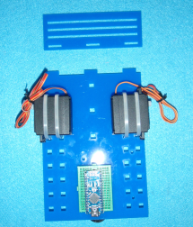
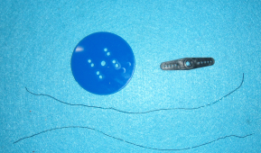
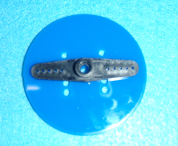
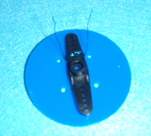
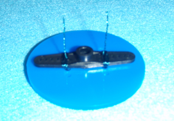

# Assembly Instructions

You can assemble your simple bot in the order that suits you best. You could do it the following way:

1. Screw the nub/dome thing to the back of your base board 
  1. Underneath the board at the bottom of the picture below
2. Stick the breadboard at the back of your base board
3. Attach the Servos to your base board
4. It should now look like:
  
5. Attach the front of the bot to the base
  1. The front is the plastic piece sitting at the top of the previous picture
6. Put the wheels together
  1. Cut 4 lengths of wire that are 20cm in length
  2. Find the rest of the parts for your wheel:
    
  3. Line up the wheel and the plastic hub:
    
  4. Use the wire to attach the plast hub to your wheel in a similar fashion to the way you would thread a button:
    
  5. Twist the ends of the wire together, this is what will tighten/lock the wheel to the hub:
    
  6. Bend the twisted wire out of the way
7. Attach the wheel to the servos, they lock on reasonably tight
8. Push your Arduino into your breadboard and wire everything up according to the electronic diagram:
  